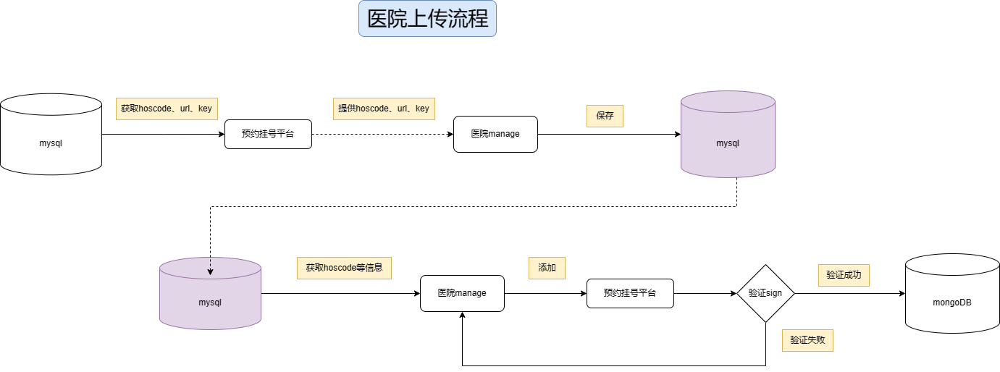
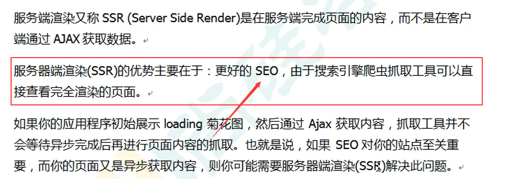
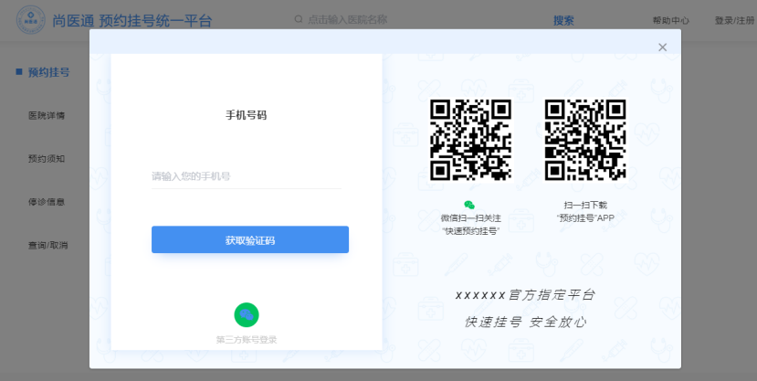
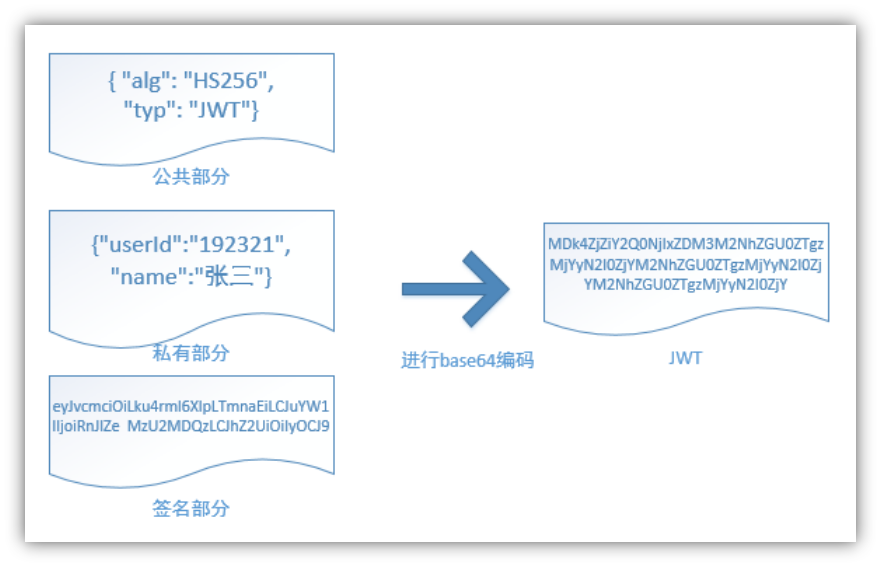
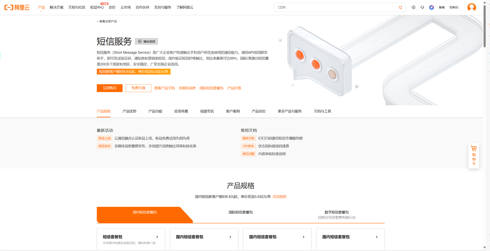
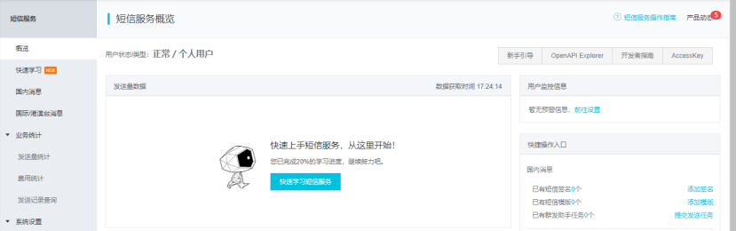
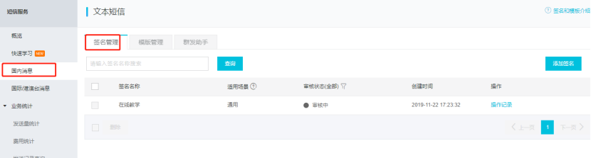
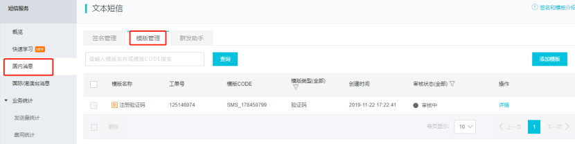
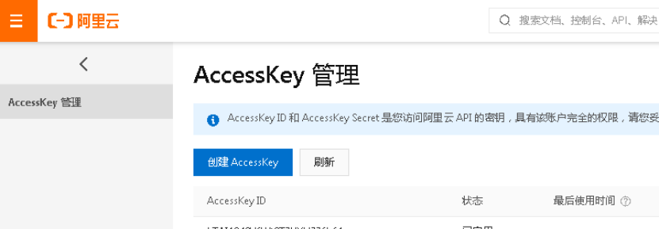

## 医院上传接口



## nacos

地址：http://192.168.114.128:8848/nacos

命名空间：yygh


### 远程调用

1. 通过maven模块的引入，将`service_client`模块引入到`serivce_hosp`（调用方）中


2. 通过服务名称在nacos注册中心获取数据，然后拼接下面的url可以获取到接口路径

   

## 网关解决跨域

没有配置网关之前使用`@CrossOrigin`进行解决

```java
/**
 * 解决跨域问题
 * @program: yygh
 * @author:
 * @create: 2024-04-10 21:39
 */
@Configuration
public class CorsConfig {
    @Bean
    public CorsWebFilter corsFilter() {
        CorsConfiguration config = new CorsConfiguration();
        config.addAllowedMethod("*");
        config.addAllowedOrigin("*");
        config.addAllowedHeader("*");

        UrlBasedCorsConfigurationSource source = new UrlBasedCorsConfigurationSource(new PathPatternParser());
        source.registerCorsConfiguration("/**", config);

        return new CorsWebFilter(source);
    }
}
```

> 需要再次去除`@CrossOrigin`注解



## 状态码

```java
package com.chai.yygh.common.result;

import lombok.Getter;

/**
 * 统一返回结果状态信息类
 */
@Getter
public enum ResultCodeEnum {

    SUCCESS(200,"成功"),
    FAIL(201, "失败"),
    PARAM_ERROR( 202, "参数不正确"),
    SERVICE_ERROR(203, "服务异常"),
    DATA_ERROR(204, "数据异常"),
    DATA_UPDATE_ERROR(205, "数据版本异常"),

    LOGIN_AUTH(208, "未登陆"),
    PERMISSION(209, "没有权限"),

    CODE_ERROR(210, "验证码错误"),
//    LOGIN_MOBLE_ERROR(211, "账号不正确"),
    LOGIN_DISABLED_ERROR(212, "改用户已被禁用"),
    REGISTER_MOBLE_ERROR(213, "手机号已被使用"),
    LOGIN_AURH(214, "需要登录"),
    LOGIN_ACL(215, "没有权限"),

    URL_ENCODE_ERROR( 216, "URL编码失败"),
    ILLEGAL_CALLBACK_REQUEST_ERROR( 217, "非法回调请求"),
    FETCH_ACCESSTOKEN_FAILD( 218, "获取accessToken失败"),
    FETCH_USERINFO_ERROR( 219, "获取用户信息失败"),
    //LOGIN_ERROR( 23005, "登录失败"),

    PAY_RUN(220, "支付中"),
    CANCEL_ORDER_FAIL(225, "取消订单失败"),
    CANCEL_ORDER_NO(225, "不能取消预约"),

    HOSCODE_EXIST(230, "医院编号已经存在"),
    NUMBER_NO(240, "可预约号不足"),
    TIME_NO(250, "当前时间不可以预约"),

    SIGN_ERROR(300, "签名错误"),
    HOSPITAL_OPEN(310, "医院未开通，暂时不能访问"),
    HOSPITAL_LOCK(320, "医院被锁定，暂时不能访问"),
    ;

    private Integer code;
    private String message;

    private ResultCodeEnum(Integer code, String message) {
        this.code = code;
        this.message = message;
    }
}
```

## 登录



（1）手机号码+手机验证码

（2）微信扫描

1，无注册界面，第一次登录根据手机号判断系统是否存在，如果不存在则自动注册

2，微信扫描登录成功必须绑定手机号码，即：第一次扫描成功后绑定手机号，以后登录扫描直接登录成功

## Token（JWT生成）

JWT最重要的作用就是对 token信息的**防伪**作用。

JWT的原理， 

一个JWT由三个部分组成：公共部分、私有部分、签名部分。最后由这三者组合进行base64编码得到JWT。



1. 添加依赖

   ```xml
   <dependency>
       <groupId>io.jsonwebtoken</groupId>
       <artifactId>jjwt</artifactId>
   </dependency>
   ```

2. 添加工具类

```java
public class JwtHelper {
    /** 令牌过期时间 */
    private static long tokenExpiration = 24*60*60*1000;
    /** 令牌签名密钥 */
    private static String tokenSignKey = "123456";

    /**
     * 根据参数生成token
     *
     * @param userId   用户id
     * @param userName 用户名
     * @return {@link String}
     */
    public static String createToken(Long userId, String userName) {
        String token = Jwts.builder()
                .setSubject("YYGH-USER")
                .setExpiration(new Date(System.currentTimeMillis() + tokenExpiration))
                .claim("userId", userId)
                .claim("userName", userName)
                .signWith(SignatureAlgorithm.HS512, tokenSignKey)
                .compressWith(CompressionCodecs.GZIP)
                .compact();
        return token;
    }

    /**
     * 根据token获取用户的id
     *
     * @param token 令牌
     * @return {@link Long}
     */
    public static Long getUserId(String token) {
        if(StringUtils.isEmpty(token)) return null;
        Jws<Claims> claimsJws = Jwts.parser().setSigningKey(tokenSignKey).parseClaimsJws(token);
        Claims claims = claimsJws.getBody();
        Integer userId = (Integer)claims.get("userId");
        return userId.longValue();
    }

    /**
     * 获取用户名称
     *
     * @param token 令牌
     * @return {@link String}
     */
    public static String getUserName(String token) {
        if(StringUtils.isEmpty(token)) return "";
        Jws<Claims> claimsJws
                = Jwts.parser().setSigningKey(tokenSignKey).parseClaimsJws(token);
        Claims claims = claimsJws.getBody();
        return (String)claims.get("userName");
    }
    public static void main(String[] args) {
        String token = JwtHelper.createToken(1L, "55");
        System.out.println(token);
        System.out.println(JwtHelper.getUserId(token));
        System.out.println(JwtHelper.getUserName(token));
    }
}
```

3. 生成token

   ```java
   String token = JwtHelper.createToken(userInfo.getId(), name);
   ```

## 阿里云短信服务











## 验证码

将生成的验证码放在redis中并设置过期的时间

```
key:手机号

value:验证码
```

```java
/**
 * 生成验证码
 * @program: yygh
 * @author:
 * @create: 2024-04-17 21:40
 */
public class RandomUtil {

    private static final Random random = new Random();

    private static final DecimalFormat fourdf = new DecimalFormat("0000");

    private static final DecimalFormat sixdf = new DecimalFormat("000000");

    public static String getFourBitRandom() {
        return fourdf.format(random.nextInt(10000));
    }

    public static String getSixBitRandom() {
        return sixdf.format(random.nextInt(1000000));
    }

    /**
     * 给定数组，抽取n个数据
     * @param list
     * @param n
     * @return
     */
    public static ArrayList getRandom(List list, int n) {

        Random random = new Random();

        HashMap<Object, Object> hashMap = new HashMap<Object, Object>();

// 生成随机数字并存入HashMap
        for (int i = 0; i < list.size(); i++) {

            int number = random.nextInt(100) + 1;

            hashMap.put(number, i);
        }

// 从HashMap导入数组
        Object[] robjs = hashMap.values().toArray();

        ArrayList r = new ArrayList();

// 遍历数组并打印数据
        for (int i = 0; i < n; i++) {
            r.add(list.get((int) robjs[i]));
            System.out.print(list.get((int) robjs[i]) + "\t");
        }
        System.out.print("\n");
        return r;
    }
}
```

> 生成6为验证码：`RandomUtil.getSixBitRandom();`

## 用户权限认证

1. 所有请求都会经过服务网关，服务网关对外暴露服务，在网关进行统一用户认证；

2. 既然要在网关进行用户认证，网关得知道对哪些url进行认证，所以我们得对ur制定规则

3. Api接口异步请求的，我们采取url规则匹配，如：/api/**/auth/**，如凡是满足该规则的都必须用户认证

